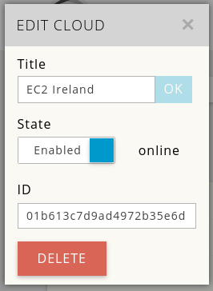
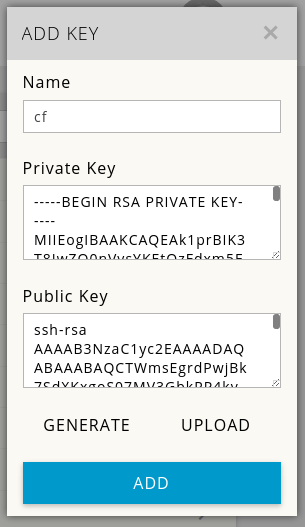
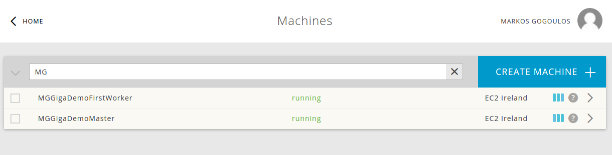
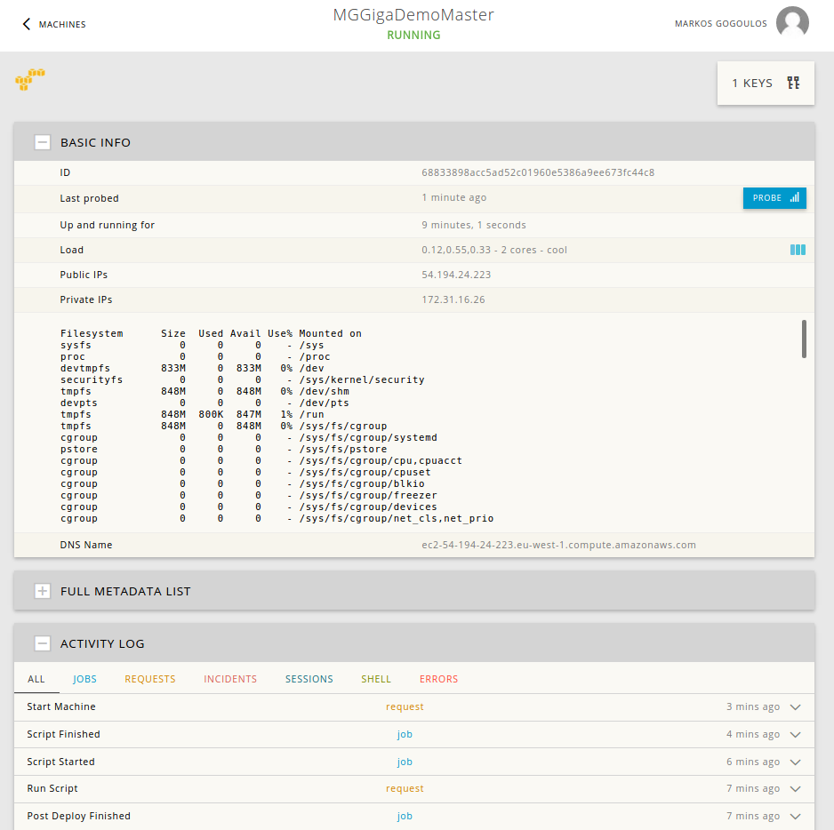

# Mist Cloudify Kubernetes Cluster Example


This repository contains a blueprint for installing a kubernetes cluster through mist.io.<br>
The aforementioned kubernetes cluster consists of:

- A kubernetes master
- A kubernetes minion (worker)

Before you begin its recommended you familiarize yourself with
[Cloudify Terminology](http://getcloudify.org/guide/3.1/reference-terminology.html).
You also need [an account on mist.io](https://mist.io/).

This has been succesfully tested on Ubuntu 14.04 and python 2.7

**Note: Documentation about the blueprints content is located inside the blueprint files themselves. Presented here are only instructions on how to run the blueprints using the Cloudify CLI with Mist.io plugin.**

## Step 1: Install the software


```
git clone https://github.com/mistio/kubernetes-blueprint
cd kubernetes-bluepring
virtualenv . # create virtualenv
source bin/activate
pip install -r dev-requirements.txt # install dependencies
pip install cloudify https://github.com/mistio/mist.client/archive/master.zip
git clone https://github.com/mistio/cloudify-mist-plugin
cd cloudify-mist-plugin
python setup.py  develop
cd ..
```

The above instructions will take 3-4 minutes to run.

## Step 2: Initialize the environment


You need to add a cloud on your mist.io account. Login to the dashboard (https://mist.kio) and click "ADD CLOUD". In our example we are adding AWS Ireland -instructions on how to add an AWS account can be found on http://docs.mist.io/article/17-adding-amazon-ec2.
<br>Note the ID of the cloud once it is added succesfully, as it will be used on the mist.yaml input file.




You also need to add an ssh key for mist.io that will be deployed to the machines once they are created. Visit the Keys tab on your mist.io dashboard and generate or upload a key. You can use separate keys for each machine. <br> Note the name, as it will be used on the mist.yaml input file.




Now enter your [account page](https://mist.io/account) and create a token on the API TOKENS tabs.

Check the blueprint file inputs section and fill
the mist input (inputs/mist.yaml) file with the necessary information.

<br>The only fields you have to modify are
<br> `api_token`(the api_token you have created through the API TOKENS tab of the mist.io account page)
<br> `key_name` (name of the key you have added/uploaded on mist.io)
<br> `cloud_id` (the cloud_id of the cloud you have added on mist.io)
<br> `image_id` (the image id of the image you are deploying. By default this is coreos beta for AWS Ireland, so if you are deploying on a different cloud you need to change this)

<br>
Then run:

`cfy local init -p mist-blueprint.yaml -i inputs/mist.yaml` <br>

This command (as the name suggests) initializes your working directory to work with the given blueprint.

The output would be something like this:

```
(kubernetes-blueprint)user@user:~/kubernetes-bluepring$ cfy local init -p mist-blueprint.yaml -i inputs/mist.yaml
Processing Inputs Source: inputs/mist.yaml
Initiated mist-blueprint.yaml
If you make changes to the blueprint, run 'cfy local init -p mist-blueprint.yaml' again to apply them
```
Now, you can run any type of workflows on this blueprint. <br>

## Step 2: Install a kubernetes cluster

You are now ready to run the `install` workflow: <br>

`cfy local execute -w install`

This command will install the kubernetes master and a kubernetes minion.

The output should be something like that: <br>

```
(kubernetes-blueprinig)user@user:~/kubernetes-blueprint$ cfy local execute -w install
2016-05-08 16:43:48 CFY <local> Starting 'install' workflow execution
2016-05-08 16:43:48 CFY <local> [key_13e52] Creating node
2016-05-08 16:43:48 CFY <local> [master_677f6] Creating node
2016-05-08 16:43:48 CFY <local> [master_677f6.create] Sending task 'plugin.kubernetes.create'
...
2016-05-08 16:52:43 CFY <local> [worker_7a12b.start] Task succeeded 'plugin.kubernetes.start'
2016-05-08 16:52:44 CFY <local> 'install' workflow execution succeeded

```

This will take a few minutes (eg 10 minutes on AWS Ireland) and will create the two nodes and setup the kubernetes cluster.

You can visit [mist.io machines page](https://mist.io/#/machines) to see the machines GigaDemoMaster and GigaDemoFirstWorker (if you used the default names on inputs/mist.yaml) have been created and click on them to view the logs if the scripts are running.



<br>
You can view the public ip of the kubernetes master on Basic Info  section of the master machine page.



Make sure the cluster has been created with kubectl

```
user@user:~/kubernetes-blueprint$ curl -O https://storage.googleapis.com/kubernetes-release/release/v1.1.8/bin/linux/amd64/kubectl && chmod +x kubectl
user@user:~/kubernetes-blueprint$ ./kubectl --server=http://54.194.24.223:8080 get nodes
NAME            LABELS                                 STATUS     AGE
172.31.25.152   kubernetes.io/hostname=172.31.25.152   Ready   2m
```


## Step 3: Scale cluster
To scale the cluster up  first edit the `inputs/new_worker.yaml` file with the proper inputs. Edit the `delta` parameter to specify the number of machines to be added to the cluster. Other input fields are the same as the inputs given on initialization. Then run :
<br>
`cfy local execute -w scale_cluster_up -p inputs/new_worker.yaml `

Example output would be something like:

```
(kubernetes-blueprint)user@user:~/kubernetes-blueprint$ cfy local execute -w scale_cluster_up -p inputs/new_worker.yaml
Processing Inputs Source: inputs/new_worker.yaml
2016-05-08 17:15:25 CFY <local> Starting 'scale_cluster_up' workflow execution
...
2016-05-08 17:18:33 LOG <local> INFO:
2016-05-08 17:18:33 LOG <local> INFO:
2016-05-08 17:18:33 LOG <local> INFO: Kubernetes worker MGGigaDemoNewWorker-2 installation script succeeded
2016-05-08 17:18:33 LOG <local> INFO: Upscaling kubernetes cluster succeeded
2016-05-08 17:18:33 CFY <local> 'scale_cluster_up' workflow execution succeeded
```

Make sure the nodes were created and added on the cluster

```
user@user:~/kubernetes-blueprint$ ./kubectl --server=http://54.194.24.223:8080 get nodes
NAME            LABELS                                 STATUS     AGE
172.31.18.235   kubernetes.io/hostname=172.31.18.235   Ready      6m
172.31.19.30    kubernetes.io/hostname=172.31.19.30    Ready      6m
172.31.25.152   kubernetes.io/hostname=172.31.25.152   Ready   32m
```


To scale the cluster down edit the `inputs/remove_worker.yaml` file and specify the delta parameter as to how many machines should be removed(destroyed) from the cluster and then run:
<br>
`cfy local execute -w scale_cluster_down -p inputs/remove_worker.yaml `

Example output would be something like:

```
(kubernetes-blueprint)user@user:~/kubernetes-blueprint$ cfy local execute -w scale_cluster_down -p inputs/remove_worker.yaml
Processing Inputs Source: inputs/remove_worker.yaml
2016-05-08 17:33:22 CFY <local> Starting 'scale_cluster_down' workflow execution
...
2016-05-08 17:33:33 LOG <local> INFO: Downscaling kubernetes cluster succeeded
2016-05-08 17:33:33 CFY <local> 'scale_cluster_down' workflow execution succeeded
```

Make sure the nodes were removed from the  cluster

```
user@user:~/kubernetes-blueprint$ ./kubectl --server=http://54.194.24.223:8080 get nodes
NAME            LABELS                                 STATUS     AGE
172.31.19.30    kubernetes.io/hostname=172.31.19.30    Ready      6m
172.31.25.152   kubernetes.io/hostname=172.31.25.152   Ready   32m
```

## Step 4: Uninstall

To uninstall the kubernetes cluster and destroy all the machines we run the `uninstall` workflow : <br>

`cfy local execute -w uninstall`

Example output will be something like:

```
(kubernetes-blueprint)user@user:~/kubernetes-blueprint$ cfy local execute -w uninstall
2016-05-07 23:40:31 CFY <local> Starting 'uninstall' workflow execution
...
2016-05-07 23:41:20 LOG <local> [master_db493.delete] INFO: Machine destroyed
2016-05-07 23:41:20 CFY <local> [master_db493.delete] Task succeeded 'plugin.server.delete'
```
